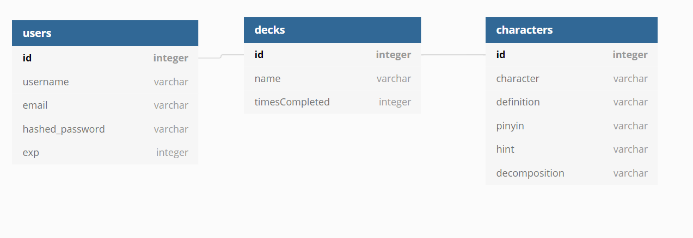

# Hanzi U

A Chinese character learning app based on frequency of character appearance.

## Demo:
Live working demo: https://hanzi-u-app.herokuapp.com/

## Built With:

 

 

## Site:
### Landing Page:

### MVPs

#### 1. User Auth

    - Create new user
    - Login/Logout

#### 2. Character decks

    -decks divided based on frequency of character appearance

#### 3. Quizzes

    -test users' knowledge and promote progress

#### 4. Progress tracker

    -track user progression and deck mastery
    -leaderboard

#### Next features:
    -quiz timer
    -card matching game
    -custom decks

#### Components

    1. Card
        -displays all info on specific character

    2. Deck
        -displays all characters of a deck

    3. DeckList
        -displays all available decks
    
    4. Quiz
        -brings together the quiz components
    

#### Database

#### References
    -character frequency based on https://hanzicraft.com/lists/frequency
    -character definitions referenced from cc-cedict.org
    
#### Created by Nick Richard
